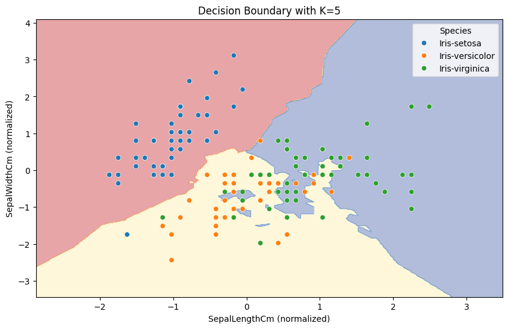

# 🚀 Task 6: K-Nearest Neighbors (KNN) Classification

This project implements the K-Nearest Neighbors (KNN) algorithm on the Iris dataset using scikit-learn. The workflow includes data normalization, experimenting with different values of **K**, evaluating the model with accuracy and a confusion matrix, and visualizing the decision boundaries.  

---

## 📂 Dataset

- **Name:** Iris Dataset  
- **Source:** [Kaggle Link](https://www.kaggle.com/datasets/uciml/iris)  
- **Classes:** Setosa, Versicolor, Virginica  
- **Features:** Sepal Length, Sepal Width, Petal Length, Petal Width  

---

## 🛠 Tools & Libraries

- Python (Colab)  
- scikit-learn  
- matplotlib  
- seaborn  
- pandas  
- opendatasets  

---

## 📌 Steps Implemented

✅ Load data using **opendatasets** from Kaggle  
✅ View and explore with **pandas**  
✅ Normalize features using **StandardScaler**  
✅ Use **KNeighborsClassifier** for classification  
✅ Test different values of **K** (1, 3, 5, 7, 9)  
✅ Evaluate with accuracy score and confusion matrix  
✅ Visualize decision boundaries (first two features)  

---

## 📊 Results

For each K value, the accuracy and confusion matrix were printed to analyze the model performance. A decision boundary plot shows how KNN separates classes in the 2D feature space.

> The decision boundary was plotted using the first two features (sepal length and sepal width) after normalization, with `K=5`.  
